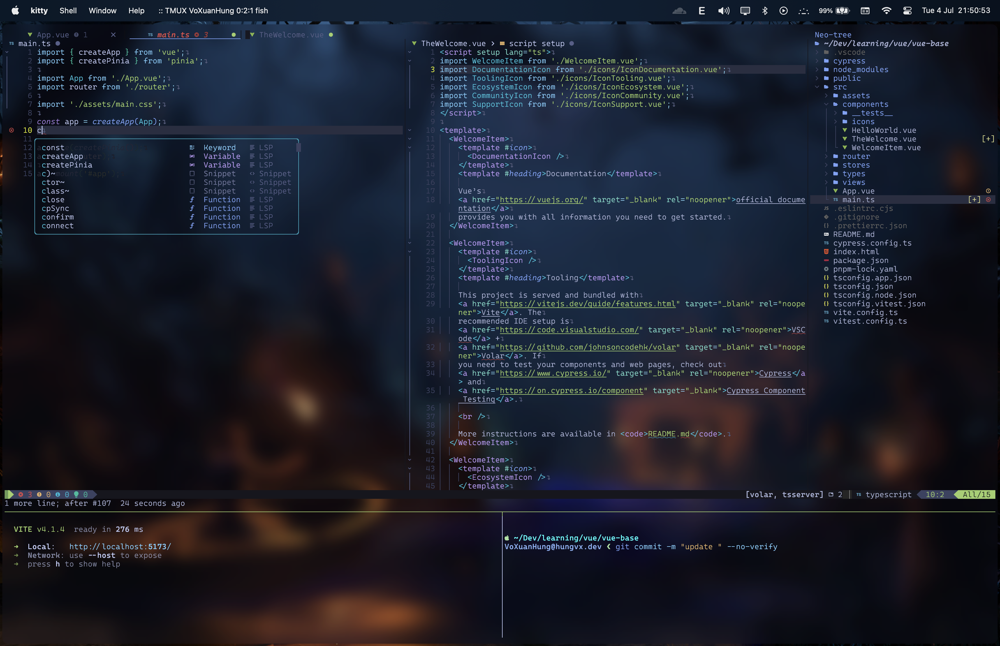
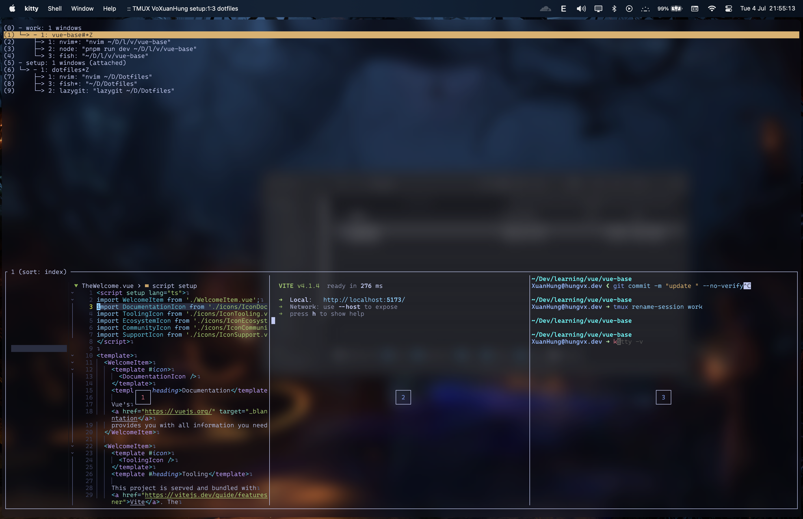

# My dotfiles
**_These are my dotfiles. Take anything you want, but at your own risk._**
**_It mainly targets macOS systems_**
**_This repository contains my configuration for applications:_**

- **Terminal**: [Kitty](./kitty) (or [Alacritty](./alacritty))
  - **Multiplexer**: [Tmux](./tmux)
  - **Theme**: [Starship](./starship)
- **Shell**: [Fish](./fish) (or [Zsh](./zsh))
- **IDE**: [Neovim](./neovim)
- **WindowManagement**: [Yabai](./yabai)
  - **Hotkey**: [skhd](./skhd)
- **Activity Monitor**: [Btop](./btop)
- **Git commands UI**: [Lazygit](./lazygit)
- **Font**: [Nerd Font](https://github.com/ryanoasis/nerd-fonts) [CaskaydiaCove](https://github.com/ryanoasis/nerd-fonts/tree/master/patched-fonts/CascadiaCode)
- **Music**: [cmus](https://github.com/cmus/cmus) [cava](./cava) [Background Music](https://github.com/kyleneideck/BackgroundMusic)
- **Wallpapers**: [My wallpapers](./wallpapers)

## Install + setup

Clone this repository:

```bash
git clone git@github.com:hungvx-dev/Dotfiles.git
cd Dotfiles
```

Run these commands to install and setup for Mac OS

```bash
chmod -R +x ./bootstrap/macos && ./bootstrap/macos/init.sh
```

## Show cases

### Terminal (Kitty + fish + starship + fzf)


### Tmux sessions




### Btop


### Neovim


### Lazygit


### Music


## References

- [Installing Fish shell on MacOS (Intel and M2) using brew](https://gist.github.com/gagarine/cf3f65f9be6aa0e105b184376f765262)
- [Installing tmux-256color for macOS](https://gist.github.com/bbqtd/a4ac060d6f6b9ea6fe3aabe735aa9d95)

## Bugs

- [eslint_d: Failed to load config](https://github.com/mantoni/eslint_d.js/issues/235#issuecomment-1441222659)
