# My dotfiles

**_This is my dotfiles. Take anything you want, but at your own risk._**
**_It mainly targets MacOS systems_**
**_This repository contains my configuration for applications:_**

## Tools

- **Package Manager**: [Nix](./nix-darwin)
- **Terminal**: [Kitty](./kitty) / [Ghostty](./ghostty)
  - **Multiplexer**: [Tmux](./tmux)
- **Shell**: [Fish](./fish)
  - **Theme**: [Starship](./starship)
- **IDE**: [Neovim](./neovim)
- **Window Management**: [Yabai](./yabai) + [skhd](./skhd)
- **Activity Monitor**: [Btop](./btop)
- **Git**:
  - [Lazygit](./lazygit)
  - [delta](https://github.com/dandavison/delta) - a syntax-highlighting pager for git, diff, and grep output
- File Manager:
  - [Yazi](./yazi/)
- **Version Manager**:
  - [fnm](https://github.com/Schniz/fnm) - 🚀 fast and simple Node.js version manager, built in Rust
- **Font**: [Nerd Font](https://github.com/ryanoasis/nerd-fonts)
  - _**JetBrainsMono**_
  - [JetBrainsMono Nerd Font](https://github.com/JetBrains/JetBrainsMono)
  - [Iosevka Nerd Font](https://github.com/be5invis/Iosevka)
- **Music**: [cmus](./cmus) + [cava](./cava) + [blackhole](https://github.com/ExistentialAudio/BlackHole)
- **Keyboard Customize**: - [karabiner-elements](./karabiner) a powerful and stable keyboard customize for macOS.
- **Vietnamese Keyboard**: [OpenKey](https://github.com/tuyenvm/OpenKey)
- **Wallpapers**: [Wallpapers](./wallpapers)
- **Music**: [Music](./Music)

## CLI: improved

- [bat > cat ](https://github.com/sharkdp/bat)
- [fd > find](https://github.com/sharkdp/fd)
- [sd > sed](https://github.com/chmln/sd)
- [rg(ripgrep) > grep](https://github.com/BurntSushi/ripgrep)
- [eza > ls](https://github.com/eza-community/eza)
- [delta > diff](https://github.com/dandavison/delta)
- [btop > top](https://github.com/aristocratos/btop)
- [tldr > man](https://github.com/tldr-pages/tldr)
- [duf > df](https://github.com/muesli/duf)
- [dust > du](https://github.com/bootandy/dust)
- [prettyping > ping](https://github.com/denilsonsa/prettyping)

## Installing

1. To download the package manager

```sh
sh <(curl -L https://nixos.org/nix/install)
```

2. To download my configuration

```sh
nix-shell -p git --run "git clone git@github.com:hungvx-dev/Dotfiles.git ~/Dev/Dotfiles"
```

3. To install it

```sh
nix run nix-darwin --extra-experimental-features "nix-command flakes" -- switch --flake ~/Dev/Dotfile/nix-darwin/feiyu
```

### Add configuation

```sh
cd ~/Dev/Dotfiles
stow .
```

### Configuation fish

- Set default shell

```sh
echo $(which fish) | sudo tee -a /etc/shells
chsh -s $(which fish)

```

- Install fisher

```sh
curl -sL https://raw.githubusercontent.com/jorgebucaran/fisher/main/functions/fisher.fish | source && fisher install jorgebucaran/fisher

fisher install kidonng/zoxide.fish
```

### Configuation git + ssh

- Git

```sh
cd ~/Dev/Dotfiles
ln -s $(pwd)/git/me/ ~/.config/git
ln -s $(pwd)/git/me/.gitconfig ~/.config/git/config
```

- SSH

```sh
ln -s $(pwd)/ssh/config ~/.ssh/config
```

- [Setup ssh](./ssh/guide.md)

### Configuation neovim

```sh
nix-shell -p nodejs_22 cargo
neovim
```

In neovim Run `:Mason` command and install LSPs

### Update packages

1.  Update flake: `nix flake update`
2.  Darwin rebuild: `darwin-rebuild switch --flake .`
3.  Clean nix store: `nix store gc`
4.  Delete old generations(optional): `nix-collect-garbage -d`
4.  Reset dock: `defaults write com.apple.dock ResetLaunchPad -bool true; killall Dock`

### Nodejs

- Enable pnpm: `corepack enable pnpm`
- Disable yarn: `corepack disable yarn`

### Cmus

- Add a Music Folder `:add /path/to/your/music`
- Rescan the Library `:update-cache`
- Remove Missing Files `:clear`
- Changing the volume in cmus `:set softvol=true`

## Show cases

### Terminal (Kitty + fish + starship)

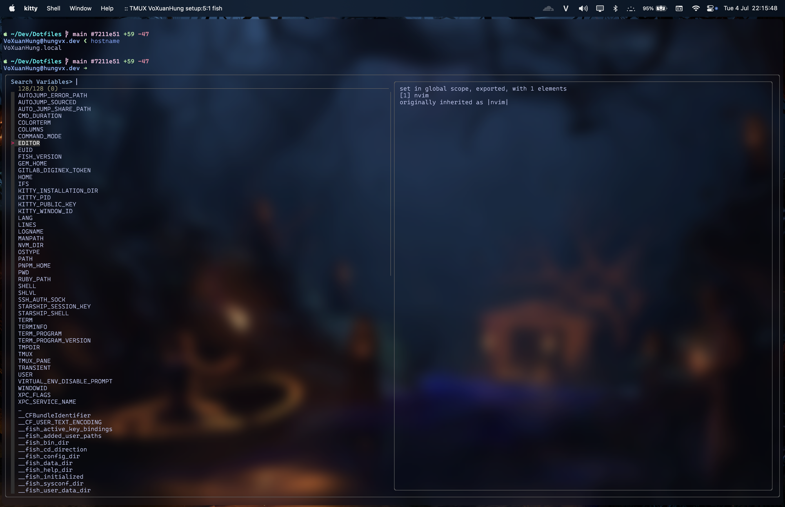
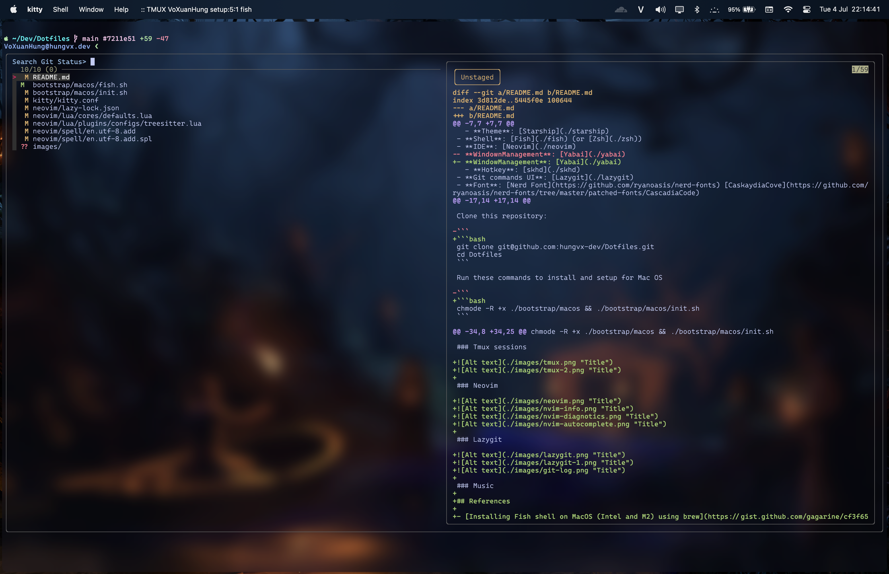

### Search (fzf + ripgrep + fd + bat)

### Multiplexer window


### Btop

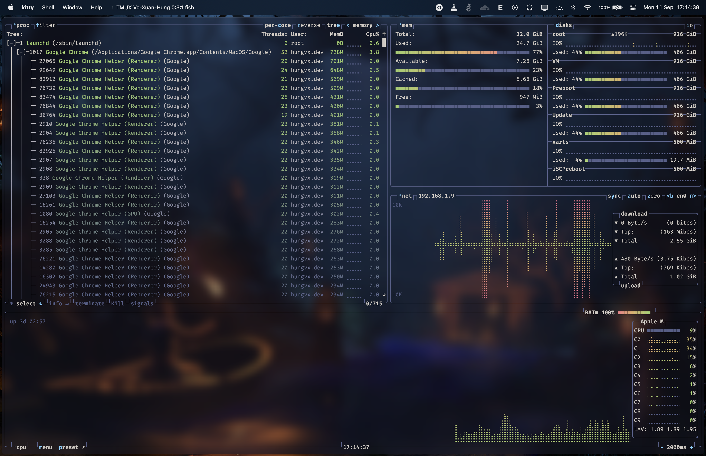

### Neovim

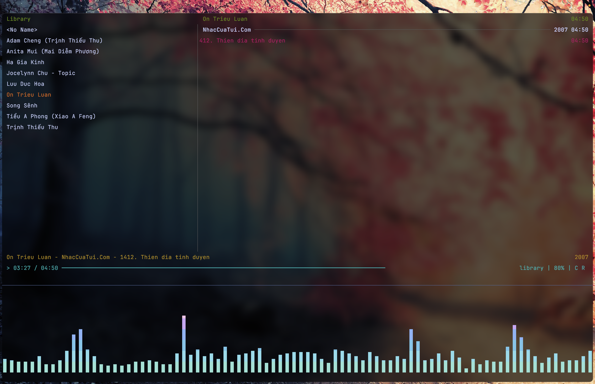
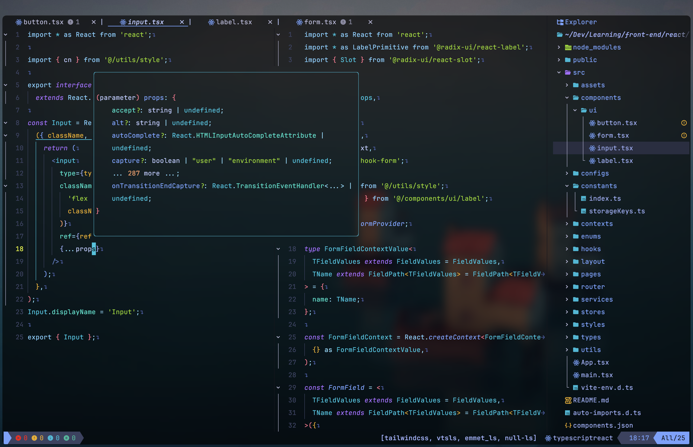
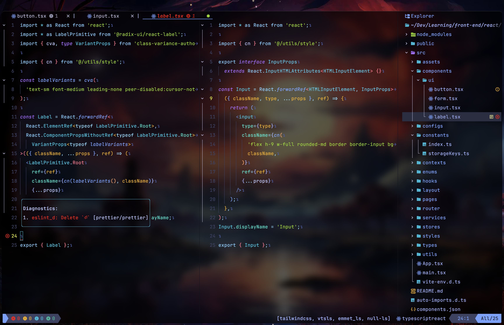
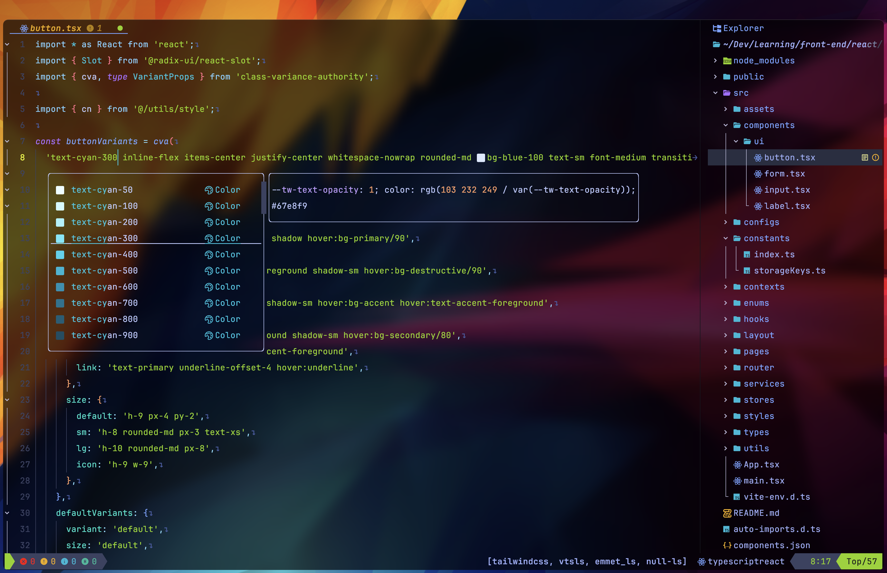
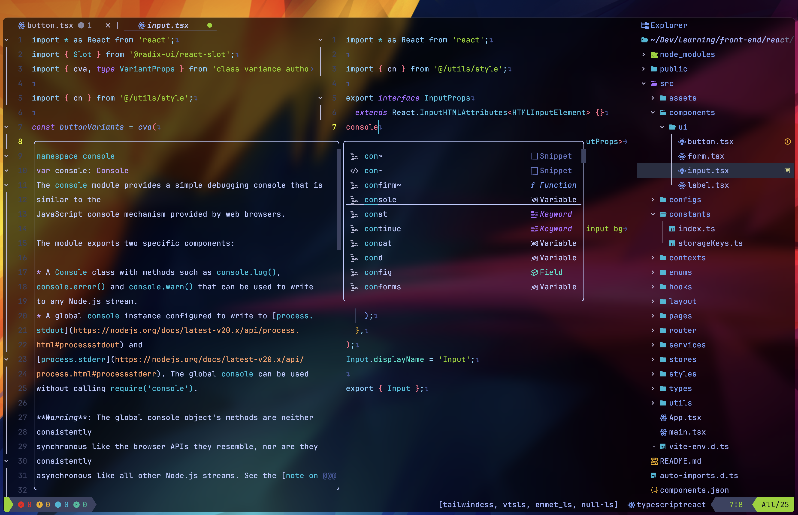

### Lazygit


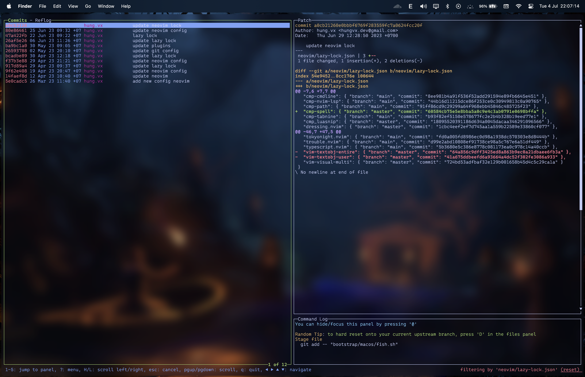
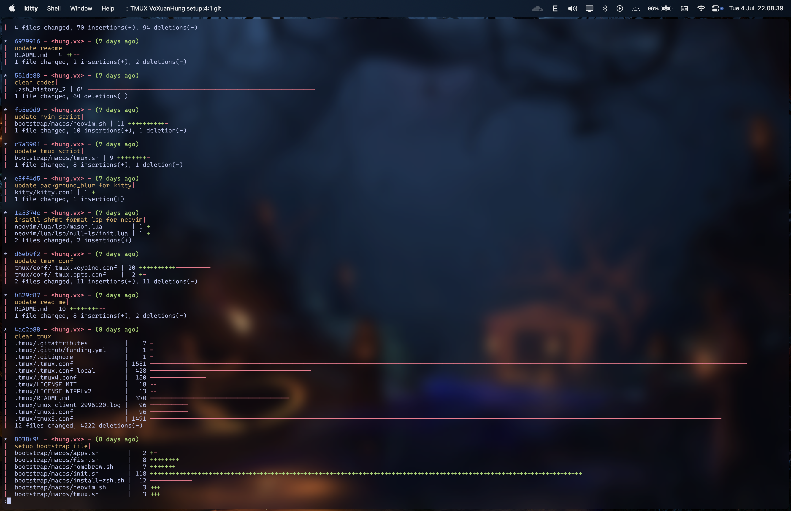

### Music

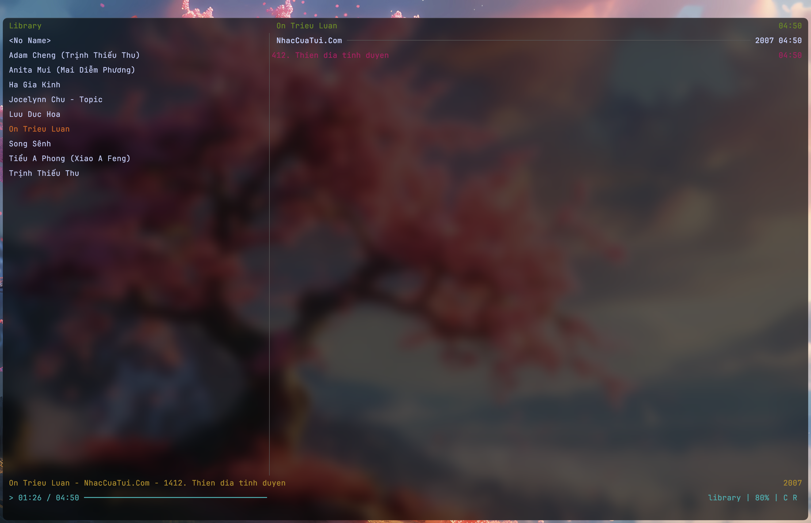
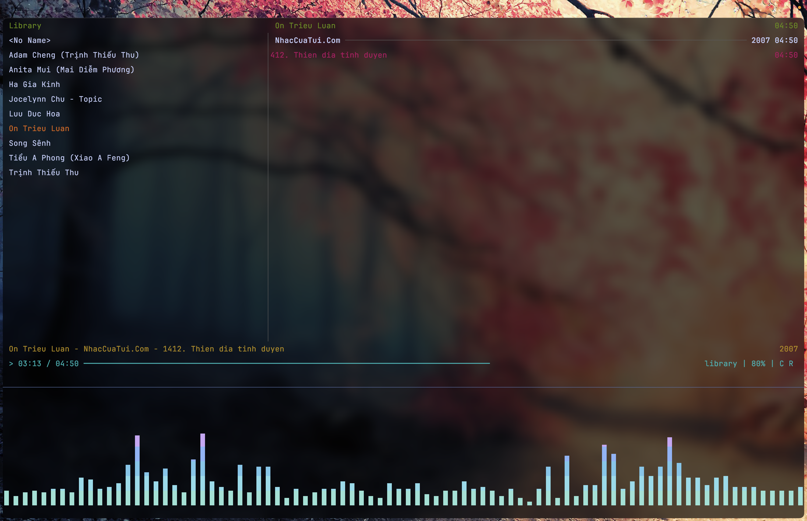

## Blogs

- [CLI: Improved](https://remysharp.com/2018/08/23/cli-improved)
- [Fuzzy Finding in Vim with fzf](https://bluz71.github.io/2018/12/04/fuzzy-finding-in-vim-with-fzf.html)
- [Mike Griffin](https://mikegriffin.ie/blog/)
- [Department of Information Technology](https://www.ditig.com/)

## References

- [Installing Fish shell on MacOS (Intel and Apple Silicon) using brew](https://gist.github.com/gagarine/cf3f65f9be6aa0e105b184376f765262)
- [Installing tmux-256color for macOS](https://gist.github.com/bbqtd/a4ac060d6f6b9ea6fe3aabe735aa9d95)
- [TIL: How to Fix ”Cannot Read Termcap Database” With Tmux and Kitty on MacOs](https://www.rockyourcode.com/til-how-to-fix-cannot-read-termcap-database-with-tmux-and-kitty-on-macos/)
- [256 colors cheat sheet](https://www.ditig.com/publications/256-colors-cheat-sheet)

## Bugs

- [eslint_d: Failed to load config](https://github.com/mantoni/eslint_d.js/issues/235#issuecomment-1441222659)
